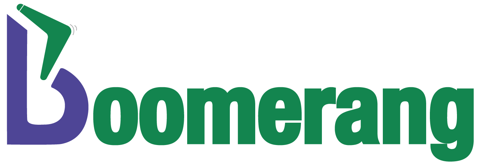

# The Boomerang Logo

Some weeks ago we set up a new team in our area where I am part of.
We named us 'Team Boomerang' because our team took over the responsible of customer retention.

I thought we should come up with a logo too and so I spent my spare time drawing an idea first on paper and designing it with Adobe's Illustrator.

I actually worked the last time with Illustrator during my study time sometime in 2000.
...A long time ago..?!

So, here you can find the outcome.

`Boomerangs B without text:`

